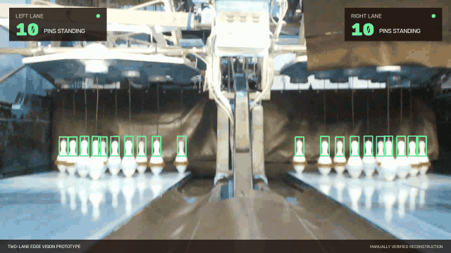

# Two-Lane Bowling Pin Detection

A real-time edge-computer-vision system that detects a bowling ball throw and
counts the pins left standing on two adjacent lanes.



[Download the full-resolution MP4](demo/showcase/bowling-detection-demo.mp4)

## The system

The prototype was designed to run entirely at the bowling alley:

- **Raspberry Pi 4** for capture and application control
- **Raspberry Pi camera** through Picamera2
- **Coral USB Edge TPU** for low-latency inference
- **OpenCV** for motion detection and visualization
- **Custom TensorFlow Lite object detector** trained to recognize the top of a
  standing pin (`topPin`)

One camera observes two lanes. Each lane is processed independently, so a throw
on one lane does not block detection on the other.

```text
Picamera2 (1280×720)
        │
        ├── left motion ROI  ── throw detected ──┐
        │                                        ├── settle ── Coral inference ── count
        └── right motion ROI ── throw detected ──┘
```

## Detection sequence

Each lane follows four states (default configuration):

| State | Behavior |
|---|---|
| `ARMED` | Detect motion in `motion_roi` to trigger the sequence. |
| `SETTLING` | Wait 100 captured frames after the trigger. |
| `SAMPLING` | Run 5 inferences on `pins_roi`; save the highest count and its annotated image. |
| `COOLDOWN` | Ignore motion until 450 captured frames after the trigger, then return to `ARMED`. |

## Repository structure

```text
src/bowling_detection/
├── config.py       Typed configuration and lane geometry
├── detector.py     Coral Edge TPU object detector
├── main.py         Picamera2 application entry point
├── motion.py       OpenCV frame-difference motion detector
├── output.py       Images, JSON results, and optional backend reporting
└── pipeline.py     Independent per-lane state machines

config/bowling.json Camera, ROI, timing, and inference calibration
model/              Label map and location for the compiled model
tests/              Hardware-independent behavior tests
demo/showcase/      Portfolio GIF and MP4
```

## Running on the original stack

The target is Raspberry Pi OS with a working Picamera2 camera and Coral USB
Edge TPU runtime. Picamera2 and PyCoral are hardware-specific system packages
and therefore are intentionally not declared as ordinary PyPI dependencies.

Create an environment that can access the Raspberry Pi system packages, then
install this project:

```bash
python3 -m venv --system-site-packages .venv
source .venv/bin/activate
pip install -e .
```

Place the Edge TPU-compiled model at:

```text
model/detect_edgetpu.tflite
```

Then start the detector from the repository root:

```bash
bowling-detect --config config/bowling.json
```

Results are written to `output/latest-left.{jpg,json}` and
`output/latest-right.{jpg,json}`.

## Calibration

The values in [config/bowling.json](config/bowling.json) reproduce the original
installation's camera geometry and timing. They are installation-specific: a
different camera position requires recalibrating both motion and pin-deck ROIs.

Coordinates use `[x1, y1, x2, y2]` in the 1280×720 camera frame:

| Lane | Motion ROI | Pin-deck ROI |
|---|---:|---:|
| Left | `[0, 420, 500, 720]` | `[0, 120, 600, 720]` |
| Right | `[780, 420, 1280, 720]` | `[680, 120, 1280, 720]` |

## Optional result reporting

The original system could post the lane, standing-pin count, device MAC address,
and annotated image to a bowling backend. To enable this integration, set
`reporting.url` in the configuration and provide the credential through the
environment:

```bash
export BOWLING_API_TOKEN="..."
```

No credential is stored in the repository, and reporting is disabled by
default.

## Preserved limitations

The labeled training dataset is no longer available, and the recovered model
binaries were incomplete. For that reason the invalid binaries are not shipped;
an intact Edge TPU-compiled model is required to run inference on hardware.

The showcase media was recreated from recovered project footage to demonstrate
the intended user-facing result. It is not presented as a new benchmark run.
